# Dine N Fine

Dine N Fine is an application developed using React Native, Expo, Tailwind, and Zustand. It allows users and establishment owners to manage and explore offers, discounts, and rewards. The backend is built with Node.js, Express, PostgreSQL, and Prisma.

## Features

### Admin App

  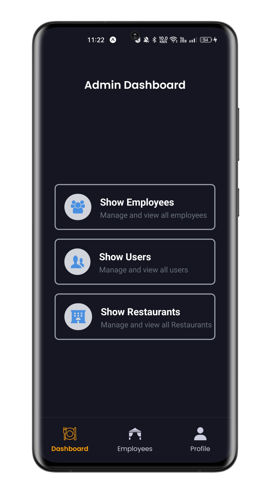
  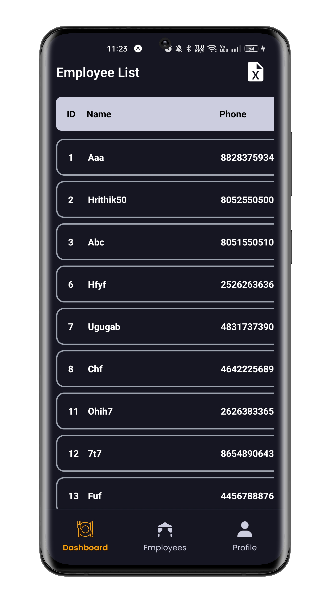
  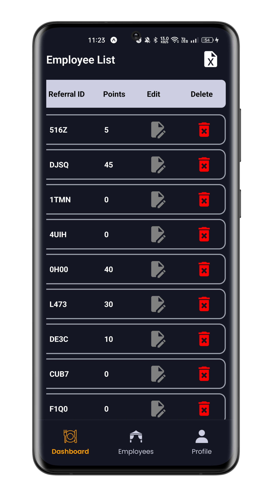
  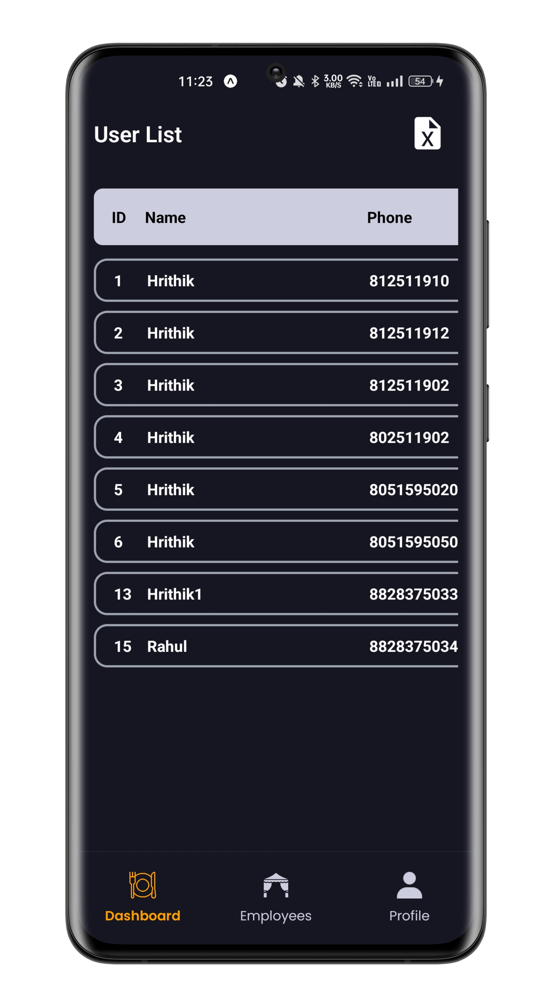
  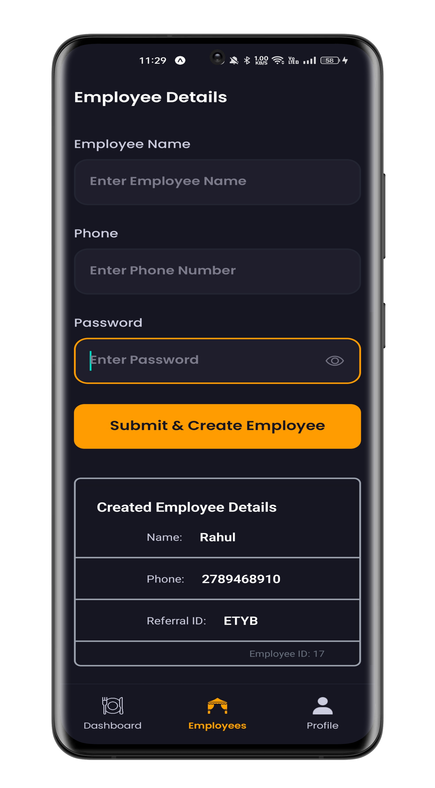
  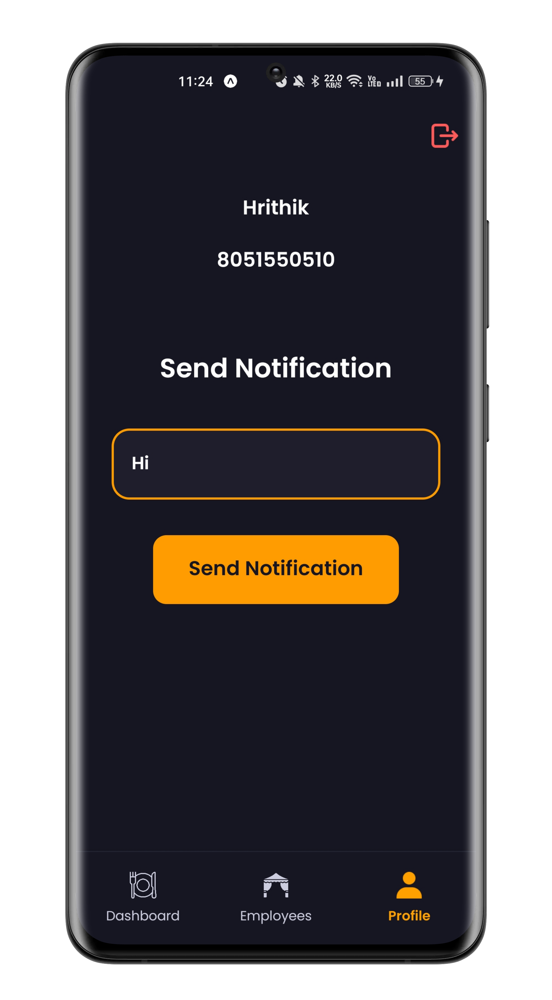

  

- **Employee Management:** Create, edit, and delete employees. Each employee gets a unique referral ID.
- **Referral System:** Employees' referral IDs can be used by restaurant owners during registration for a 10% discount. Employees earn 100 points per referral, which can be redeemed for benefits.
- **User and Establishment Management:** View users and establishments in the dashboard.
- **Notification System:** Sends notifications about new offers and updates.

### Restaurant App

  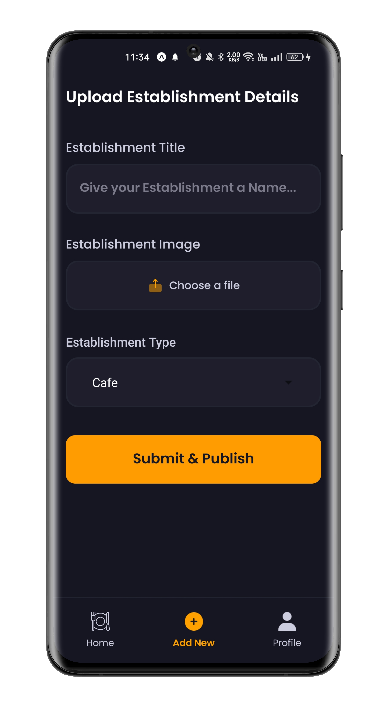
  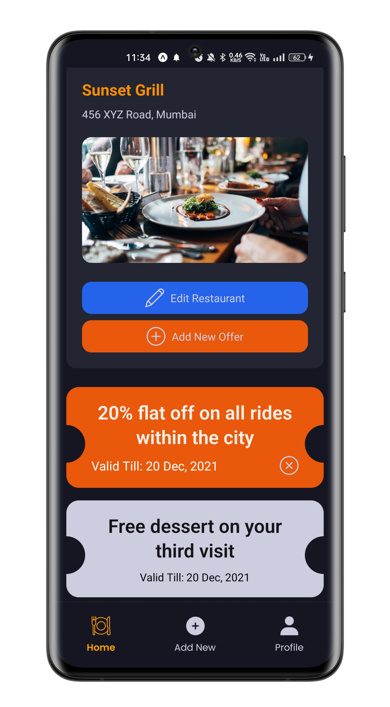

  

- **Registration for Establishment Owners:** Collects personal information and location permission. Free 6-month subscription for the first 100 establishments.
- **Offer Management:** Add, modify, and categorize offers, discounts, and rewards by type.

### User App

  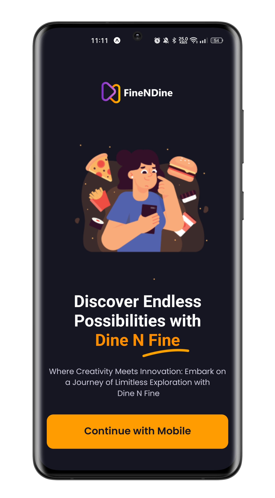
  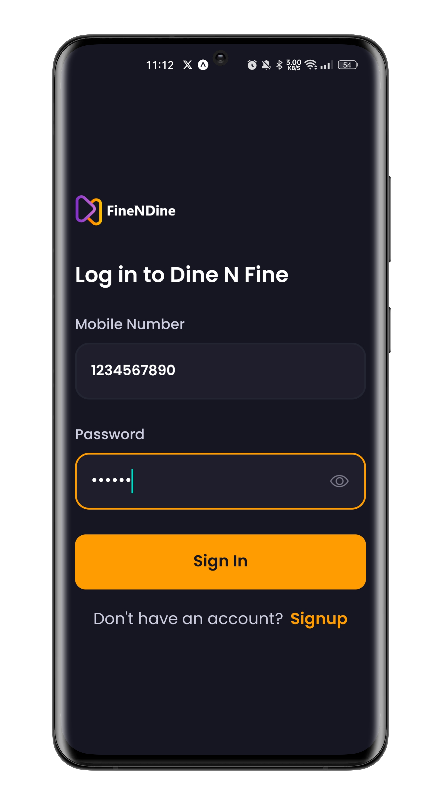
  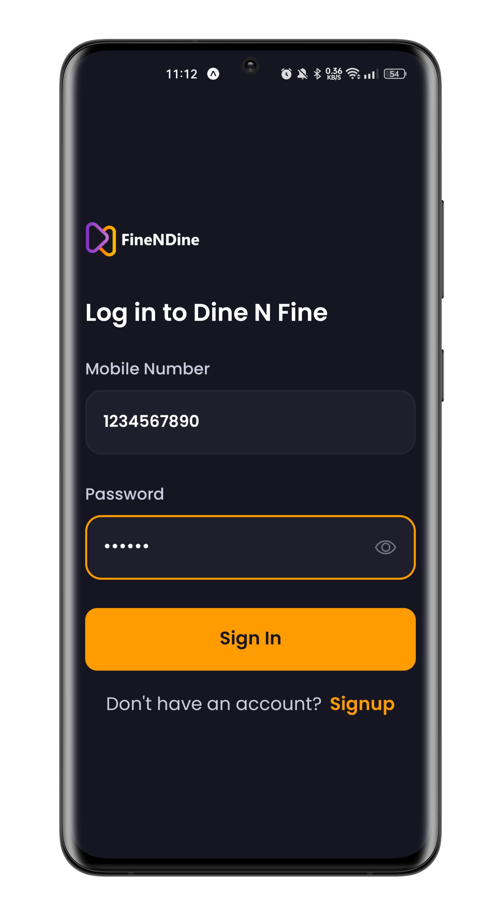
  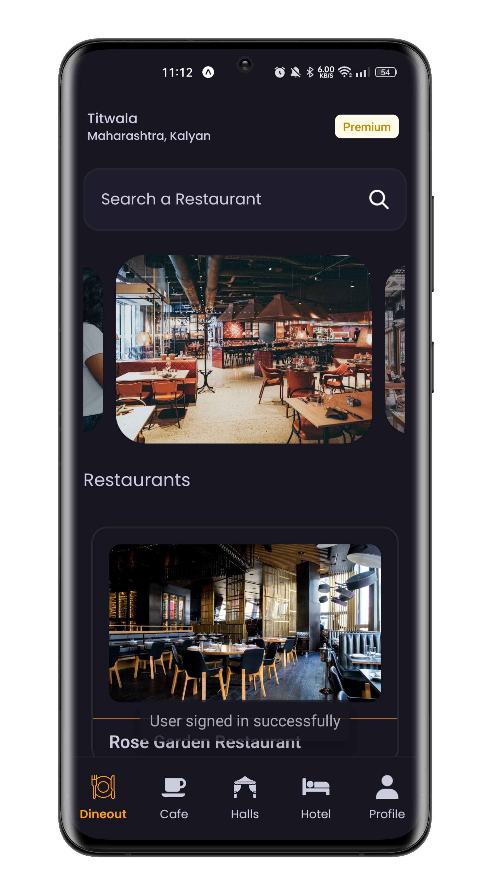
  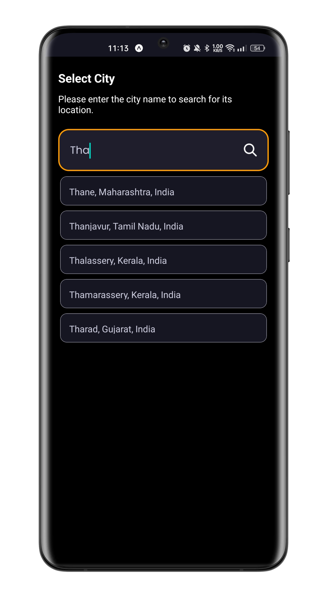
  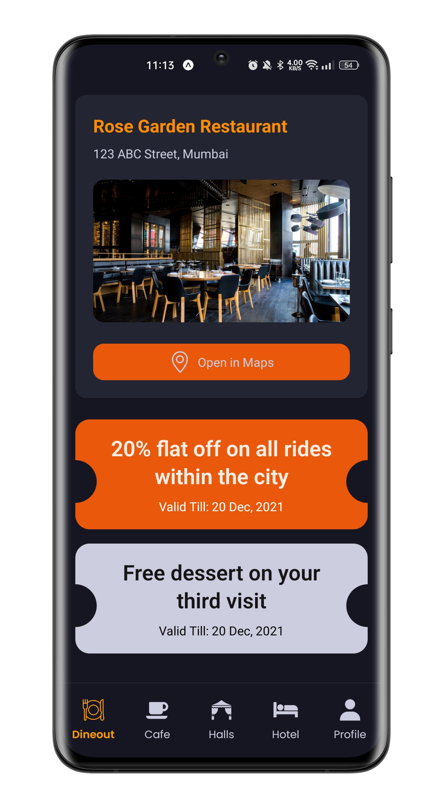

  

- **Location-Based Offers:** View offers based on current or selected location.
- **Establishment Carousel:** Browse a carousel of restaurants, cafes, hotels, and banquet halls.
- **Establishment Details:** View detailed information including address, offers, gifts, rewards, and discounts.
- **Membership Tiers:** Four tiers (Royal, Platinum, Gold, Silver) with different benefits.
- **Free Membership Offer:** First 500 users receive free Gold membership for 6 months.

## Technologies Used:

- React Native, Expo, Tailwind, Zustand, Google Places API, Node.js, Express, PostgreSQL, Prisma.
